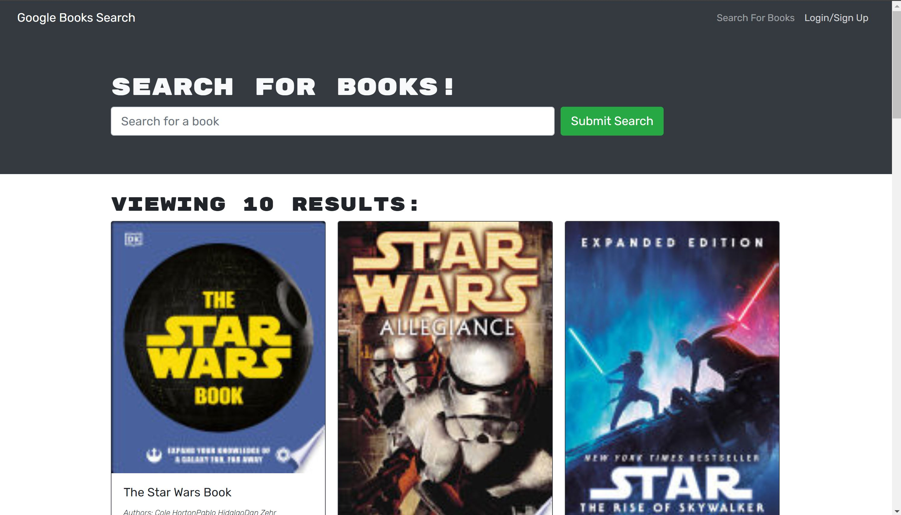

# Book-Search-Engine

## Description
Book-search-engine is a MERN application that utilizes the Google book API to search books. Simply create an account, search for a book and add it to your personal library. Done reading a book? You can edit your collection and remove or add any books. There are a lot of books out there, this app with allow you to get to know more of them. Read on!
## Table of Contents
* [Link](#link)
* [Screenshot](#Scrrenshot)
* [License](#license)
* [Questions](#questions)

## Link
Checkout out the app!
https://pure-refuge-64079.herokuapp.com/

## Screenshot

## License
Book-search-engine is licensed under the MIT License.

## Questions
If you have any question please check out my GitHub https://github.com/ortizjavier10 or email me at ortiz.javier10@gmail.com .
